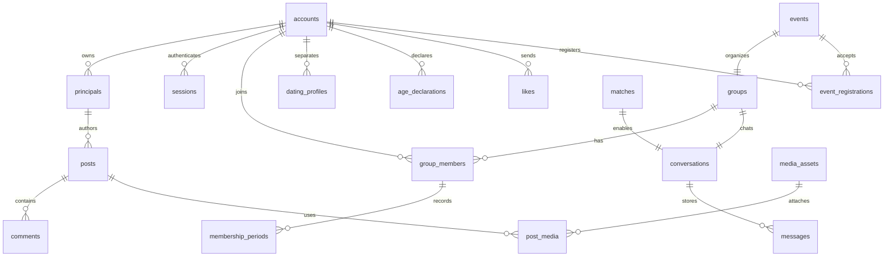

# 在日华人交友 App 数据库与 API 详细设计

2026-10-04实现方向调整：后端Java/Spring Boot、Maven构建测试、MyBatis数据库访问已确认。现有54表SQL、约束、业务事务和OpenAPI REST合同保留；Java基础配置、MyBatis/Flyway、API健康及worker已验证，测试库已审计接续；业务实现仍待后续阶段，Prisma资料只作历史参考。[第1阶段实施计划](../plans/2026-10-03-stage-1-engineering-foundation.md)明确Flyway默认和实时协议待确认边界。

结构文件已生成于[packages/database](../../../packages/database/README.md)，包含Prisma模型、SQL初始迁移与隔离数据库测试；本文中的业务API事务和worker仍待实施。字段默认值及PostgreSQL专用约束以该包的规范源和迁移文件为实施依据。

## 1. 设计范围与决策状态

本稿供开发评审，依据[产品方案](2026-10-03-social-app-design.md)、[技术方案](2026-10-03-social-app-technical-design.md)及[页面与交互方案](2026-10-03-social-app-ui-interaction-design.md)的最新确认部分。旧稿中 verified 默认条件、组织者预授权及仅匹配后可私聊的描述，以后续确认与本文为准。当前已有数据库迁移、合同及原TS基础健康测试；业务尚未实现，目标Java/MyBatis路径待重新验收。

已确认：日本首发、中文、iOS/Android、邮箱注册、游客留言板图文、注册创建群与直接加入、注册发布活动、普通私聊独立于恋爱匹配、恋爱采用主动开启加 18 岁自我声明、内容限制与一年保留。首版聊天为文字，与留言板图片权限分开。

采用PostgreSQL＋MyBatis、Java/Spring Boot模块化单体、Maven、REST、S3和独立outbox worker。SQL迁移默认Flyway，Spring事务协调行锁与Mapper；实时传输建议Spring WebSocket＋JSON，具体协议待确认。关系、状态机、名额、锁序及REST合同保留，版本在实施时固定。

普通私聊接收与首次联系限额、活动修改取消及报名退出、群容量与创建配额、群主自愿转让及解散已确认，见第14节。邮箱验证码登录细节、免费活动、审核规则及其他频率仍为建议。正式恋爱上线边界沿用技术方案，本稿不新增证件上传流程。

## 2. 数据与接口共同约定

- 表名、列名用 snake_case；接口 JSON 用 camelCase。主键 UUID，所有外键与目标类型一致。业务表默认含 `id uuid PK`、`created_at timestamptz`、`updated_at timestamptz`，下表只列额外字段；不需要更新时间的流水表注明只含 created_at。
- 时间以 UTC 存储，JSON 为带 Z 的 ISO 8601；客户端按 Asia/Tokyo 显示。地区用标准代码，不保存连续定位。序号、计数游标的 bigint 在 JSON 中使用十进制字符串。
- 表中 `?` 表示可空；未标 `?` 的字段必填。FK 为外键，UQ 为唯一约束。状态是受数据库 CHECK 或枚举约束的值，不能接受任意字符串。正文是纯文本。
- 字典未重复标类型的 `*_id` 为 UUID（region_code、interest code 除外），`*_at`/`*_after`/`*_until` 为 timestamptz，version/position/attempts/capacity/count 为整数，开关为 bool，正文/名称/状态/摘要/对象键为 text；sequence/size_bytes明确使用bigint，params/payload/preferences/changed_fields为JSONB。`client_message_id` 使用包含时间的 UUIDv7，独立于服务端主键。
- 默认 `ON DELETE RESTRICT`；关系占位与清理任务完成后再按顺序物理删除。纯连接表可 CASCADE，但不能用账号级级联删除绕过内容、对象存储与审计清理。
- JSONB 仅用于允许字段集合明确的通知参数、任务参数和变更摘要，不用于代替账号、成员、名额等关系。任何参数都不得包含验证码、令牌或长期正文副本。
- 字符限额按 Unicode 可见字符（grapheme cluster）计数，中文、组合 emoji 不按 UTF-16 单元计数；前后端共享规则。统一 NFC 正规化后验证、存储，超限拒绝，不截断。
- 图片上限的工程定义为 5 MB＝5,000,000 bytes；JPEG/PNG/WebP 静态图，解码像素最多 20,000,000。展示图长边最多 1920，不放大小图，体积目标最多 1 MB；去 EXIF，原图不公开。

| 场景 | 已确认限额 |
|---|---|
| 帖子标题 / 正文 | 60 / 2000 个可见字符，均非空 |
| 回复 / 单条聊天 | 各 1000；回复有图片时允许无文字，聊天不能为空 |
| 活动标题 / 说明 | 60 / 3000 |
| 群名称 / 介绍 | 30 / 1000 |
| 帖子图片 / 回复图片 | 9 / 3 张 |
| 活动封面 / 恋爱照片 | 1 / 6 张 |

昵称、个人简介、群规及取消原因限额尚未确认，建议初值为 30/500/2000/500，发布前评审；不要误套群介绍限额到全部字段。

## 3. 核心关系图



图只展示主要关系；普通私聊通过账号对和 conversation_participants 关联。群、活动、匹配在对应事务提交后拥有唯一会话/活动群；创建草稿尚无活动群。

## 4. 数据字典

### 4.1 身份、会话与公开资料

| 表 | 额外字段与约束 |
|---|---|
| accounts | email_normalized text UQ、status(active/restricted/deleting/deleted)、auth_version int、deletion_requested_at?；邮箱不进入公开 DTO |
| principals | kind(guest/account)、account_id? FK accounts、claimed_at?；account 主体必须绑定账号；一个账号有一个 account 主体，可接续多个 guest 主体 |
| guest_credentials | principal_id FK、secret_hash text UQ、revoked_at?、last_used_at；只存摘要，接续后撤销旧游客凭证 |
| sessions | account_id FK、refresh_hash UQ、family_id uuid、replaced_by_id? FK sessions、expires_at、revoked_at?、platform；轮换旧记录保留到该 family 过期以识别重放 |
| email_challenges | email_normalized、purpose(login/register/delete_account)、code_hmac、attempts、expires_at、consumed_at?；失败计数原子递增，成功单次消费 |
| profiles | account_id FK UQ、nickname、bio、avatar_media_id? FK media_assets、region_code? FK regions、visibility(public/hidden)；不含恋爱偏好 |
| account_settings | account_id FK UQ、allow_stranger_dm bool默认true已确认、push_enabled bool、lockscreen_preview bool；后两项建议默认true/false |
| regions | code text PK（例外，无 UUID id）、parent_code? FK regions、level(prefecture/municipality)、name_ja、name_zh、active；以版本化地区种子维护 |
| interests | code text UQ、name_zh、active、sort_order |
| profile_interests | account_id FK、interest_id FK，复合 PK；纯连接表无默认 id/时间 |
| push_devices | account_id FK、installation_id uuid、token_ciphertext、token_hash UQ、platform、revoked_at?；建议安装标识 UQ，切换账号先撤销旧绑定 |

邮箱去两端空白并统一大小写作为本产品登录策略，不进行 Gmail 点号/加号别名合并；保留展示地址非必要。验证码用服务器秘密参与 HMAC，不能只存低熵验证码的普通摘要。建议有效 10 分钟、最多 5 次、发送间隔 60 秒；令牌建议访问 15 分钟、刷新 30 天。Redis 限流，不是验证码消费或会话撤销的唯一依据。

游客内容作者引用稳定 principal；注册时不重写 posts/comments 的 author_principal_id。账号管理授权使用 principal.account_id 绑定关系，公开显示仍按原游客身份。游客标识按帖子生成；公开 DTO 不返回 principal_id、邮箱或跨帖子稳定游客 ID。

### 4.2 留言板与文件

| 表 | 额外字段与约束 |
|---|---|
| posts | author_principal_id FK、display_mode(guest/account)、scope(public/dating)、category(interest/city/general)、title、body、region_code? FK、status、published_at?、expires_at?、deleted_at?、version int |
| comments | post_id FK、author_principal_id FK、display_mode、reply_to_id?、body、status、published_at?、expires_at?、deleted_at?、version；复合 FK `(post_id,reply_to_id)` 指向 comments 的 UQ `(post_id,id)`，禁止跨帖引用与自引用 |
| post_interests | post_id FK、interest_id FK，复合 PK，纯连接表 |
| media_assets | owner_principal_id FK、purpose(board/profile/dating/event)、object_key UQ、status、mime、size_bytes bigint、width?、height?、checksum?、upload_expires_at、cleanup_after?、deleted_at? |
| post_media | post_id FK、media_id FK UQ、position int，UQ(post_id,position)，纯连接表 |
| comment_media | comment_id FK、media_id FK UQ、position，UQ(comment_id,position)，纯连接表 |
| media_variants | media_id FK、kind(display/thumbnail)、object_key UQ、size_bytes、width、height，UQ(media_id,kind) |

统一内容状态：pending → visible 或 rejected；visible → hidden/deleted/expired；hidden 可复核恢复但不续期；rejected 编辑重提进入 pending；deleted/expired 不可恢复。首次 visible 才写 published_at/expires_at，隐藏再恢复不重置。首版 public 区开放游客，dating scope 是预留领域，不自动新增恋爱留言板接口。

图片状态 initiated → uploaded → processing → approved/rejected；任意阶段可进入 deleting → deleted。上传完成不是审核通过。关联图片以客户端 mediaIds 顺序形成 position，服务端锁定资源检查所有权、用途、完成状态及未绑定，整批关联原子提交。数据库触发器或受控绑定服务保证资源只能绑定一个所有者位置，跨连接表不能复用同一个附件；头像、恋爱照片、封面同样参与该规则，数量变更锁定父记录。查询可见性由所属内容及访问者决定，不设置能绕过权限的公开 URL 字段。

待审投稿可绑定 uploaded/processing 图片，但提交后内容保持 pending；任何失败图片令投稿 rejected，审核异常继续 pending。建议未关联上传 24 小时清理、待审 72 小时告警进入人工处理，待审最终清理期限仍需运营确认。资料与活动的图文修改采用审核版本，审核通过前旧版本不被未审核内容替换。

### 4.3 群、成员与聊天

| 表 | 额外字段与约束 |
|---|---|
| groups | creator_id FK accounts、owner_id FK accounts、type(ordinary/event/dating)、name、description、rules、region_code? FK、interest_id? FK、status(active/readonly/closed)、capacity? int、active_count int、version、dissolved_at?；普通群capacity默认100且包含群主，解散后readonly，closed仅用于禁止读取的关闭 |
| group_members | group_id FK、account_id FK、role(owner/member)、status(active/left/banned)、muted bool、UQ(group_id,account_id) |
| membership_periods | group_member_id FK、start_sequence bigint、end_sequence? bigint、joined_at、left_at?；只有一个未关闭区间，使用部分唯一索引；起止序号非负且 end≥start |
| conversations | type(group/direct/dating)、group_id? FK UQ、match_id? FK UQ、account_low_id? FK、account_high_id? FK、status(active/readonly/closed)、last_sequence bigint；按类型 CHECK 字段组合，账号对 low<high，UQ(type,account_low_id,account_high_id) |
| conversation_participants | conversation_id FK、account_id FK、muted bool、archived_at?，复合 PK；只用于两人会话，群权限读取 group_members |
| messages | conversation_id FK、sender_id FK accounts、client_message_id uuid、sequence bigint、body、status(visible/deleted/expired)、sent_at、expires_at；UQ(sender_id,client_message_id)、UQ(conversation_id,sequence) |
| read_cursors | conversation_id FK、account_id FK、last_read_sequence bigint、updated_at，复合 PK，无默认 id/created_at |
| message_request_receipts | sender_id FK、client_message_id、conversation_id FK、request_hash、message_id? FK、sequence、result_state(saved/expired)，UQ(sender_id,client_message_id)；只留元信息，重放期限建议 30 天需与离线重试期限确认 |

普通群不设申请表或 pending 成员。群主唯一的部分索引约束 active owner；groups.owner_id 与成员 owner 的一致性由同事务/延迟约束触发器保障，不能用跨表 CHECK 假装实现。活动群发布者作为 owner，不占参加者 capacity；报名名额计数与群人数不是同一计数。

第一次加入时 start_sequence＝当前 last_sequence＋1。退群时关闭区间；重新加入创建新区间，只能读取当前加入区间，不自动读取以前区间或退出期间消息。当前 active 才允许读；活动结束/取消后原 active 成员可在 readonly 状态读未到期记录，取消报名者立即失去读写权。群内拉黑过滤显示与通知，不能阻止对方浏览公开帖子。

两人会话按类型分开：同一账号对可同时有 direct 与 dating。恋爱取消匹配后旧会话 closed；再次匹配建议重新激活该账号对会话，历史仍受原到期及当前资格限制，此复用策略待评审。不能将恋爱入口转换成 direct 以绕过匹配。

### 4.4 恋爱独立资料

| 表 | 额外字段与约束 |
|---|---|
| age_declarations | account_id FK UQ、status(self_declared/withdrawn)、statement_version、declared_at、withdrawn_at?、expires_at?；无记录表示未声明，withdrawn 后保留一年 |
| dating_profiles | account_id FK UQ、enabled bool、intro、region_code? FK、preferences jsonb、status(pending/visible/rejected/hidden)、version；偏好允许字段先评审，不接受任意敏感字段 |
| dating_profile_interests | account_id FK dating_profiles.account_id、interest_id FK，复合 PK，纯连接表 |
| dating_photos | account_id FK dating_profiles.account_id、media_id FK UQ、position，UQ(account_id,position)，最多六张，纯连接表 |
| likes | from_account_id FK、to_account_id FK、decision(like/skip)、UQ(from_account_id,to_account_id)，CHECK(from≠to) |
| matches | account_low_id FK、account_high_id FK、status(active/ended)、matched_at、ended_at?，CHECK(low<high)，UQ(low,high) |

首版资格＝正常注册账号＋有效 self_declared＋enabled＋可见审核资料；推荐、受控图片、恋爱详情和通信均查同一策略。年龄声明不产生 verified 标记。关闭恋爱或撤销声明立即禁止相关查询/发送/事件推送，但不影响普通私聊。核验供应商表与 webhook 在正式方案确定后增加，本次不创建假接口。

### 4.5 活动、运营与可靠任务

| 表 | 额外字段与约束 |
|---|---|
| events | creator_id FK accounts、group_id? FK UQ、cover_media_id? FK、title、description、region_code FK、starts_at、ends_at、registration_deadline、capacity int、confirmed_count int、status(draft/pending/open/ended/cancelled/hidden)、cancellation_policy、cancel_reason?、cancelled_at?、version；0≤count≤capacity、capacity>0、deadline≤starts<ends |
| event_private_details | event_id FK UQ、meeting_instructions、version；只有发布者、有效报名者及有理由的运营权限可读 |
| event_interests | event_id FK、interest_id FK，复合 PK，纯连接表 |
| event_registrations | event_id FK、account_id FK、status(confirmed/cancelled/left)、accepted_event_version int、registered_at、cancelled_at?、left_at?、expires_at?，UQ(event_id,account_id)；开始前cancelled释放名额，开始后left不释放历史报名名额 |
| event_revisions | event_id FK、version、changed_fields jsonb、reason、actor_id FK，UQ(event_id,version)；不复制私有集合全文，清理期限跟活动记录策略 |
| blocks | blocker_id FK accounts、blocked_id FK、UQ(blocker_id,blocked_id)，CHECK(两者不同)，只含 created_at |
| reports | reporter_principal_id FK、target_type、post_id?/comment_id?/message_id?/account_id?/group_id?/event_id? 各自 FK、reason_code、detail、status(open/reviewing/resolved)、resolved_at?、expires_at?；CHECK恰好一个目标并与类型匹配 |
| admin_accounts | login_name text UQ、password_hash、status(active/disabled)、role(reviewer/operator/auditor)、mfa_secret_ciphertext、auth_version int；仅reviewer/operator按授权处理内容，auditor只读审计 |
| admin_sessions | admin_id FK admin_accounts、token_hash UQ、mfa_verified_at、expires_at、revoked_at?；不复用用户令牌，操作不可由客户端指定操作者 |
| moderation_actions | report_id? FK、admin_id FK、action、target_type与各目标可空FK、reason、created_at、expires_at；采用同 reports 的单目标约束，无正文复制，流水无 updated_at |
| notifications | account_id FK、type、target_type、target_id uuid、params jsonb、read_at?、expires_at；目标为跳转线索，读取目标重新鉴权，失效不可回显缓存正文 |
| outbox | event_type、aggregate_type、aggregate_id、payload jsonb、status(pending/processing/succeeded/dead)、attempts、available_at、lease_until?、last_error_code?、dedupe_key UQ |
| processed_events | consumer、event_key、processed_at，复合 PK，无默认 id/时间；供应商或消费者重复事件去重 |
| idempotency_records | actor_key、method、route_key、key、request_hash、status、resource_type?、resource_id?、response_code?、expires_at，UQ(actor_key,method,route_key,key)；不缓存消息正文或秘密令牌 |
| deletion_jobs | target_type、target_id、reason、status、requested_at、completed_at?、retry_after?、dedupe_key UQ；完成前可重试 |
| deletion_ledger | target_type、target_id、deleted_at、purge_reason；不含正文/邮箱，用于备份恢复后重放，期限至少覆盖最长可恢复备份窗口，具体窗口待定 |

通知目标为多态线索，允许原对象删除，不作为授权依据；举报使用真实 FK，因为处理时必须验证其存在及举报者访问资格。账号被注销后举报必要流水去标识化；不因结构外键保留姓名或正文。图片审批、公开资料/活动版本暂存可增加 `moderation_revisions`：目标类型、目标ID、version、允许字段快照、expires_at；只用于待审短期内容，不复制聊天正文，获批后删除快照。

## 5. 数据库约束、索引与事务

索引设计：

| 访问模式 | 索引/约束 |
|---|---|
| 留言板列表 | posts(scope,status,published_at DESC,id DESC)；地区筛选(region_code,status,published_at DESC,id DESC)；post_interests(interest_id,post_id) |
| 回复及本人发布 | comments(post_id,status,published_at,id)；posts(author_principal_id,created_at DESC,id)，comments同类作者索引 |
| 群与成员 | group_members(account_id,status,group_id)；membership_periods(group_member_id,start_sequence)；群按地区/兴趣加列表索引 |
| 聊天补取 | messages(conversation_id,sequence) UQ；participants(account_id,conversation_id)；expires_at,id 清理索引 |
| 恋爱推荐与匹配 | dating_profiles(enabled,status,region_code,account_id)；likes方向UQ及反向(to,from)；matches账号对UQ |
| 活动列表与我的报名 | events(status,region_code,starts_at,id)；registrations(account_id,status,event_id) |
| 清理、通知与队列 | 各内容(expires_at,id)，notifications(account_id,created_at DESC,id)，outbox(status,available_at,id)，deletion_jobs(status,retry_after,id) |

查询条件始终追加权限与 `expires_at > now()`，不能只依赖每小时删除。时间游标使用 `(published_at,id)` 等稳定二元排序；新增回复不能更改旧帖排序起算。中文初版使用参数化关键词检索，可先小规模 ILIKE；不能承诺默认全文分词满足中文搜索，规模上升前验证查询计划与检索质量。

单行 CHECK、UQ、FK 保障本地不变量；跨表计数和最多九图由事务加锁或触发器保障。部分索引、CHECK、延迟触发器写入受版本管理的SQL migration，Java/MyBatis不自动建表，不假设应用校验等于数据库约束。[PostgreSQL 约束文档](https://www.postgresql.org/docs/current/ddl-constraints.html)

所有写路径统一锁顺序：账号行按 UUID 升序 → 活动 → 群 → 会话 → 成员/附件/消息。操作不存在的中间类别跳过，取得后不能逆序新增锁；注销只先撤销账号，关联群和内容交给后续独立事务，避免批量循环互锁。外部邮件、上传、审核及推送不在持锁事务内等待。行锁与有限重试用于竞争，死锁/序列化失败最多重试三次，重试共享原幂等键。[PostgreSQL 行锁说明](https://www.postgresql.org/docs/current/explicit-locking.html)、[MyBatis Spring事务](https://mybatis.org/spring/transactions.html)

| 场景 | 同一数据库事务内的步骤 |
|---|---|
| 游客接续 | 锁账号与游客主体，验证未绑定他人，绑定 account_id，撤销游客凭证，消费验证码；唯一邮箱竞争时返回已有账号登录结果，失败全部回滚 |
| 创建普通群 | 创建群、创建 owner 成员、创建唯一会话和首个加入区间；owner从会话确定；成功才开放聊天 |
| 普通加入/退出 | 锁账号→群→会话，检查状态/封禁/容量，更新成员及区间和 count；重复加入不加人数，退出重复不减人数；无审批步骤 |
| 发送消息 | 锁发送者及两人会话对方账号→必要的群→会话，再查资格、拉黑/接收、区间；查client ID去重，增加last_sequence，写消息、收据、outbox，提交后ACK |
| 双向喜欢 | 锁两个账号，校验资格及拉黑，写like；检查反向like，创建/恢复唯一match与dating会话及参与者；两个并发like不会遗漏匹配 |
| 报名/取消报名 | 锁账号→活动→活动群→会话，查开放状态/时间/容量；更新报名，开始前取消减confirmed_count、开始后退出不减，写/撤销成员资格和区间，写outbox；任一步失败回滚 |
| 取消活动 | 锁发布者→活动→群→会话，验证version，改cancelled与readonly，写唯一取消通知任务；通知名单从提交时报名快照ID生成，不在事务内发送 |
| 修改活动 | 锁发布者→活动，校验version及capacity≥confirmed_count，保存新审核版本，获批提交时重新检查约束；重要修改按建议要求确认并创建通知任务 |
| 拉黑/资格撤销 | 锁相关账号，更新关系/声明/auth_version，提交权限失效事件；之后发送必读新状态，网关移出room且广播前再次过滤 |

## 6. REST 通用协议

所有接口前缀 `/v1`，HTTPS；权限标记 P＝公开、G＝游客凭证或账号、U＝正常注册、D＝当前恋爱资格、O＝对象所有者、A＝独立管理员。O 必须结合 G/U 基础身份，不是仅知道对象ID。读隐藏或无权对象统一 404，写已知操作无权可返回403；不泄露拉黑关系。

`Authorization: Bearer <accessToken>` 用于账号或管理员；游客使用 `X-Guest-Token`，普通请求不同时发送两个身份。只有注册/登录/接续接口允许账号身份与额外游客凭证共同证明。首次公开浏览不创建游客。移动端提供 installationId 只用于安装/推送绑定，不证明内容所有权。

列表 `limit` 默认20、最大50；`cursor` 为服务端不透明游标，包含筛选摘要和排序键。更换筛选重置游标；游标不是授权令牌。返回 `{data:[],page:{nextCursor:null,hasMore:false},requestId}`；单对象 `{data:{...},requestId}`；删除成功204无正文。创建201；异步受理202；普通查询/更新200。

可重试创建/动作要求 `Idempotency-Key` UUID；与主体、方法、路径及规范化请求摘要绑定。同键异体409 `IDEMPOTENCY_CONFLICT`，处理中返回409 `REQUEST_IN_PROGRESS` 和重试提示；完成后重建当前有权DTO，不返回过期正文。建议普通收据保存24小时，消息按 clientMessageId 和独立元信息收据去重；离线请求超过约定重放期拒绝，不静默作为新消息发布。刷新与验证码消费采用专门单次令牌规则，不持久缓存秘密响应。

消息去重建议边界：clientMessageId采用UUIDv7，服务端验证其时间位不早于30天前、不晚于服务器5分钟；客户端生成后重试不得更换。收据从首次受理起至少保留30天，过期旧ID返回409 RESULT_EXPIRED；修改ID就是新的发送操作，仍受限流，不属于原请求重试。时间位不用于证明身份或决定sent_at。一年后即使消息与收据已清理，原ID也无法被当作新消息重放。普通24小时幂等键仅保证窗口内去重，窗口外由资源唯一约束和状态处理，并不承诺所有动作永远去重。以上30天离线窗口为工程建议，改变时需同步ID校验和收据清理策略。[UUIDv7格式规范](https://www.rfc-editor.org/rfc/rfc9562.html#section-5.7)

更新有版本的资源要求 `If-Match: "<version>"`，缺少428 `VERSION_REQUIRED`、不一致412 `VERSION_CONFLICT`；返回新version。重要活动修改另提交 `confirmChanges:true`，不能仅靠 If-Match 代表用户确认。

```json
{
  "code": "VALIDATION_FAILED",
  "message": "正文最多 2000 个字符",
  "requestId": "req_demo",
  "details": [{"field": "body", "reason": "MAX_LENGTH", "limit": 2000}]
}
```

| HTTP / code | 客户端行为 |
|---|---|
| 400 INVALID_CURSOR / INVALID_REQUEST | 重置游标或修正输入 |
| 401 AUTH_REQUIRED / SESSION_REVOKED | 刷新失败后登录，保留草稿 |
| 403 ACCOUNT_RESTRICTED / DATING_REQUIRED | 禁止操作，展示资格或限制说明 |
| 404 CONTENT_UNAVAILABLE | 不展示缓存正文，返回或显示占位 |
| 409 EVENT_FULL / EVENT_CLOSED / GROUP_FULL | 刷新详情，不自动重复报名或加入 |
| 409 MEDIA_NOT_READY / REQUEST_IN_PROGRESS | 保留编辑，等待/查询状态；pending审核图片可提交待审投稿，不等于MEDIA_NOT_READY |
| 409 RESULT_EXPIRED | 旧请求结果已过期，不重新发布 |
| 412 VERSION_CONFLICT / 428 VERSION_REQUIRED | 重新读取并由用户确认，不覆盖他人改动 |
| 422 VALIDATION_FAILED | 显示字段错误，不截断 |
| 429 RATE_LIMITED | Retry-After，保留输入 |
| 503 TEMPORARILY_UNAVAILABLE | 使用原幂等键重试，不能提示业务成功 |

## 7. REST 接口目录与数据契约

下表仅省略固定 `/v1` 前缀。所有 ID 是 UUID，`mediaIds` 是本主体且用途正确的资源ID列表；任何作者、管理员、群主ID都由服务端身份取得。

### 7.1 身份与个人设置

| 方法与路径 | 权限 | 请求 → 核心响应/效果 |
|---|---|---|
| POST /guest-sessions | P，风险限流 | 空body → 201 principal管理凭证guestToken；principalId仅本机私有响应 |
| POST /auth/email-code | P | email,purpose → 202 challengeId,expiresIn,retryAfter；统一响应避免枚举邮箱 |
| POST /auth/register | P＋可选游客证明 | challengeId,code,termsVersion,privacyVersion,guestToken? → 201 accessToken,refreshToken,account,onboardingRequired；已有邮箱不覆盖资料，转受验证登录 |
| POST /auth/login | P＋可选游客证明 | challengeId,code,guestToken? → 200 同会话DTO；验证码purpose匹配 |
| POST /auth/refresh | 刷新令牌 | refreshToken → 新令牌对；旧令牌再用撤销family |
| POST /auth/logout | U | 当前会话撤销 → 204，并解绑当前推送安装 |
| POST /me/guest-claims | U＋游客证明 | guestToken → 200 claimedContentCounts；已绑定本账号幂等，他账号拒绝 |
| GET /me | U | → 私有账号、资料、设置、onboardingRequired、年龄声明状态，不返回秘密 |
| PATCH /me/profile | U，版本 | nickname,bio,regionCode,interestIds,avatarMediaId? → 私有ProfileDTO/审核状态 |
| PATCH /me/settings | U | allowStrangerDm,pushEnabled,lockscreenPreview → SettingsDTO；关闭恋爱另走dating接口 |
| GET /profiles/{accountId} | P | → PublicProfileDTO：id,nickname,bio,avatar,region,interests,canMessage；不返回恋爱与活动记录 |
| DELETE /me | U＋删除验证码 | challengeId,code → 202 deletionJobId；立即撤销会话/推送/访问 |
| PUT /me/push-devices/{installationId} | U | token,platform → 200绑定；token只写不回显 |
| DELETE /me/push-devices/{installationId} | U | → 204，不能解绑他人安装 |
| GET /regions；GET /interests | P | parentCode? / 空 → 字典列表与版本 |

条款版本接受记录写入 `consent_records(account_id,terms_version,privacy_version,accepted_at)`，只含必要版本及时间，独立保留策略待定；注册不能只依赖前端checkbox。邮箱删除挑战必须与当前账号邮箱绑定。游客接续为可选，失败不能丢失登录或自动认领他人内容；登录会话创建与接续分别报告 `claimStatus`，接续失败保持原游客凭证可重试。

### 7.2 留言板、图片与兴趣发现

| 方法与路径 | 权限 | 请求/查询 → 核心响应 |
|---|---|---|
| GET /posts | P | q?,regionCode?,interestId?,category?,sort=latest,cursor?,limit? → PublicPostSummary[] |
| GET /posts/{postId} | P | → PublicPostDTO；不可见404，本人待审从/me/content读 |
| POST /posts | G，幂等 | title,body,category,regionCode?,interestIds[],mediaIds[] → 201 id,status,publishedAt?,expiresAt?，可能pending |
| PATCH /posts/{postId} | G＋O，版本 | 同编辑字段 → 200；建议仅 rejected/pending 重提，visible不开放直接编辑 |
| DELETE /posts/{postId} | G＋O | → 204，立即不可见并排队删图，不删除未过期回复正文 |
| GET /posts/{postId}/comments | P | cursor?,limit? → 可见ReplyDTO[]；父帖不可见时不开放公开查询 |
| POST /posts/{postId}/comments | G，幂等 | body,replyToId?,mediaIds[] → 201 ReplySubmitDTO；父帖必须visible且未过期 |
| PATCH /comments/{commentId} | G＋O，版本 | body,mediaIds[] → 200，编辑状态同帖子建议 |
| DELETE /comments/{commentId} | G＋O | → 204，子引用只保留关系与不可用说明 |
| GET /me/content | G | kind=posts/comments,cursor? → OwnContentDTO[]，含审核及父帖占位；按接续主体合并 |
| GET /me/content/{kind}/{contentId} | G＋O | → 本人内容及审核状态；expired/deleted只给无正文占位 |
| GET /discovery/interests/{interestId} | P | regionCode?,cursor? → 主题简介、公开讨论及群概要；各分区独立游标 |
| POST /media/upload-intents | G，幂等 | purpose,fileName?,mime,sizeBytes → 201 mediaId,uploadUrl,uploadHeaders,expiresAt |
| POST /media/{mediaId}/complete | G＋O，幂等 | checksum? → 202 status；核对实际对象大小/类型，重复完成不重复审核 |
| GET /media/{mediaId} | G＋O | → 上传/审核状态；资源不包含公开存储键 |
| GET /media/{mediaId}/access | 按用途及内容权限 | variant → 200受控短时URL；仅approved且父内容可见，无权404 |
| DELETE /media/{mediaId} | G＋O | → 204；已绑定资源必须经父对象修改/删除，拒绝破坏他人关联 |

PublicPostDTO 包含 id,title,body,authorDisplay,region,interests,images,replyCount,publishedAt,expiresAt,capabilities；authorDisplay 为游客标签或公开账号信息，不暴露游客主体。媒体访问接口可公开访问 approved public 父内容，其余按 G/U/D 权限重新检查。返回的短时链接最长不超过内容剩余寿命；对象/CDN删除重试不能代替即时 API 拒绝。回复最多单层引用展示：允许引用同帖评论，但UI扁平化，不无限嵌套。

### 7.3 群、消息与普通私聊

| 方法与路径 | 权限 | 请求/查询 → 核心响应 |
|---|---|---|
| GET /groups；GET /groups/{groupId} | P普通概要，受控类型D/U | regionCode?,interestId?,cursor? → 群概要；不返回聊天和成员名单 |
| POST /groups | U，幂等 | name,description,rules?,regionCode?,interestId → 201 group,conversationId,role=owner；客户端不能建event/dating类型 |
| PATCH /groups/{groupId} | U＋owner，版本 | name,description,rules,regionCode? → 200，审核重要修改 |
| POST /groups/{groupId}/join | U，幂等 | 空 → 200 membership,conversationId；仅普通群直接加入，受控群按资格来源 |
| DELETE /groups/{groupId}/membership | U | → 204退出；owner须先完成自愿转让，只有自己时可解散 |
| GET /groups/{groupId}/members | U＋active成员 | cursor? → 注册成员公开资料与角色 |
| PATCH /groups/{groupId}/membership | U＋active成员 | muted → 自己的设置 |
| DELETE /groups/{groupId}/members/{accountId} | U＋owner | reason → 204移除并封禁，不能移除自己/其他owner |
| POST /groups/{groupId}/owner-transfer | U＋owner，幂等 | targetAccountId → 201 transferRequestId,status=pending；目标须active，等待本人同意，不直接替换owner |
| POST /groups/{groupId}/owner-transfers/{transferId}/accept | U＋指定接任者，幂等 | accepted=true → 200原子转让；双方仍active、原owner仍有效及配额合格才提交 |
| POST /groups/{groupId}/close | U＋owner，幂等 | confirmed=true,reason? → 200 readonly,dissolvedAt，停止加入和发送、通知成员，保留原成员未到期历史；活动群改由活动取消/结束接口管理 |
| GET /me/groups | U | cursor? → 当前群、角色、未读摘要 |
| POST /direct-conversations | U，幂等 | targetAccountId,source=publicProfile/groupMember,sourceGroupId? → 200/201 ConversationDTO；无年龄/匹配要求 |
| GET /conversations | U | type?,cursor? → 自己有权会话及未读，不返回到期预览 |
| GET /conversations/{conversationId}/messages | U，按类型鉴权 | afterSequence?或beforeSequence?,limit? → MessagePageDTO；二者不能同时给 |
| POST /conversations/{conversationId}/messages | U，按类型鉴权 | clientMessageId,body → 201/重复200 MessageDTO，与WS共用服务 |
| PUT /conversations/{conversationId}/read-cursor | U，按类型鉴权 | lastReadSequence → 200，只能单调递增至有权当前高水位 |
| PATCH /conversations/{conversationId}/settings | U参与者/成员 | muted,archived? → 200自己的设置，不改变群状态 |

普通私聊需目标具有可公开普通账号资料或共同有效群资料来源，服务端验证source，不接受客户端伪造出处。双方拉黑时禁止双方发送；目标关闭陌生私聊时拒绝新的首次联系，已有成功发送的会话仍可继续；空会话不构成既有联系。source不授权恋爱资料转普通身份；恋爱DTO没有direct入口。

MessageDTO＝id,conversationId,senderDisplay,clientMessageId,sequence,body,sentAt,expiresAt,status。补取响应另含 `scannedThroughSequence`、`hasMore`、`nextCursor`：记录因过期/拉黑过滤产生序号空洞，客户端仍推进扫描游标，不能无限重复查询。read cursor不会重新授权旧消息，未读数基于当前可见未过期消息，不把last_sequence差值直接当未读。

### 7.4 恋爱

| 方法与路径 | 权限 | 请求/查询 → 核心响应 |
|---|---|---|
| POST /dating/age-declarations | U，幂等 | accepted=true,statementVersion → 200 self_declared,declaredAt；不接受verified或生日推断 |
| DELETE /dating/age-declarations | U | → 204撤销并禁止恋爱访问，撤销起一年计时 |
| GET /me/dating-profile | U | → 私有编辑资料；未声明可查看自己的设置，不能查看他人 |
| PUT /me/dating-profile | U＋self_declared，版本 | intro,regionCode,interestIds,photoMediaIds,preferences → 200状态；enabled独立操作 |
| PATCH /me/dating-profile/enabled | U | enabled → 200；开启须self_declared且资料合格，关闭无需资格 |
| GET /dating/candidates | D | regionCode?,interestId?,cursor? → 受控DatingSummary[]，过滤封禁/拉黑/自己 |
| GET /dating/profiles/{accountId} | D | → DatingProfileDTO，目标也须有效可见，不含普通私聊入口 |
| POST /dating/likes | D，幂等 | targetAccountId,decision=like/skip → 200 matched,matchId?,conversationId?；不暴露对方跳过行为 |
| GET /dating/matches | D | cursor? → active匹配列表 |
| DELETE /dating/matches/{matchId} | D＋参与者 | → 204结束匹配和dating通信，普通会话不受影响 |

年龄未声明时禁止恋爱照片上传/完成/访问、推荐、详情及likes；可在声明后编辑尚未enabled资料。自己的编辑权限与他人发现权限区分，不能为了准备资料强迫先公开。

### 7.5 活动、通知、举报与后台

| 方法与路径 | 权限 | 请求/查询 → 核心响应 |
|---|---|---|
| GET /events；GET /events/{eventId} | P公开概要 | regionCode?,interestId?,from?,to?,cursor? → EventPublicDTO，不含集合详情/名单 |
| POST /events | U，幂等 | title,description,regionCode,interestIds,startsAt,endsAt,registrationDeadline,capacity,cancellationPolicy,meetingInstructions,coverMediaId? → 201 id,status,version；默认提交审核，可指定saveAsDraft=true |
| PATCH /events/{eventId} | U＋发布者，版本 | 可编辑字段,changeReason?,confirmChanges? → 200审核/更新状态；取消不接受PATCH status |
| POST /events/{eventId}/cancel | U＋发布者，版本＋幂等 | reason → 200 cancelled；已有取消返回同结果 |
| POST /events/{eventId}/end | U＋发布者，版本＋幂等 | confirmed=true,reason → 200 ended；开始后可提前结束，通知成员，群转readonly，保留记录 |
| GET /events/{eventId}/private-details | U＋发布者/confirmed报名 | → 集合说明；取消后原有效报名者按建议仍可读，过期/已取消报名者拒绝 |
| POST /events/{eventId}/registrations | U，幂等 | acceptedEventVersion,acceptedRules=true → 201/重复200 registration,conversationId；发布者无需占报名名额 |
| DELETE /events/{eventId}/registrations/me | U | → 204；开始前cancelled释放名额，开始后left不释放历史报名名额；两种情况均撤销群访问资格 |
| GET /events/{eventId}/registrations | U＋发布者 | cursor? → 参加者公开资料及报名状态，不公开名单给其他报名者 |
| GET /me/events | U | role=participant/creator,status?,cursor? → 我的活动与报名 |
| GET /notifications | U | cursor? → NotificationDTO，无锁屏敏感正文 |
| PUT /notifications/{notificationId}/read | U＋O | 空 → 200 readAt；不能读他人通知 |
| POST /reports | G，幂等 | targetType,targetId,reasonCode,detail? → 201 id,status；须有权查看目标，游客不能举报私有聊天 |
| GET /me/reports | G | cursor? → 本人举报结果，不返回管理员或其他举报者资料 |
| POST /blocks | U，幂等 | targetAccountId → 200屏蔽，禁止自屏蔽 |
| GET /blocks；DELETE /blocks/{accountId} | U | → 自己名单 / 204解除 |
| POST /admin/auth/login；POST /admin/auth/mfa | 管理身份 | 专门凭证与挑战 → 独立管理会话，不支持用户Bearer |
| GET /admin/reports；GET /admin/reports/{reportId} | A审核角色 | status?,cursor? → 最少必要上下文，有访问审计 |
| GET /admin/content | A审核角色 | status=pending/rejected,targetType,cursor? → 待审队列，内容权限与对象用途匹配 |
| POST /admin/moderation-actions | A对应角色，幂等 | targetType,targetId,action,reason,expectedVersion → 201审计和处理结果 |
| GET /admin/groups；GET /admin/events；GET /admin/accounts | A对应角色 | 查询、分页 → 管理概要，不默认暴露私聊正文 |
| GET /admin/tasks；POST /admin/tasks/{taskId}/retry | A运维角色 | 查询 / 空 → 队列状态 / 202重试，成功任务不重执行 |
| GET /admin/audit-actions | A审计角色 | cursor?,from?,to? → 操作流水，只含必要信息 |

EventPublicDTO＝id,title,description,cover,region,interests,startsAt,endsAt,registrationDeadline,capacity,confirmedCount,status,cancellationPolicy,version,capabilities。报名必须接受当前version，版本变化返回412，让用户看完新规则再确认。活动修改取消及报名退出按第14节已确认规则执行；免费及结束后集合信息清理策略仍需评审，不允许隐藏操作静默取消报名。

## 8. 请求与响应示例

以下 UUID 为虚构示例，正式 OpenAPI 将从本稿转为可校验的 DTO；本次不交付宣称可运行的 API 代码。

```http
POST /v1/posts
X-Guest-Token: <guestToken>
Idempotency-Key: 11111111-1111-4111-8111-111111111111
Content-Type: application/json
```

```json
{
  "title": "周末一起拍东京的秋天？",
  "body": "手机也可以，想沿着河边慢慢走。",
  "category": "interest",
  "regionCode": "JP-13",
  "interestIds": [],
  "mediaIds": ["22222222-2222-4222-8222-222222222222"]
}
```

```json
{
  "data": {
    "id": "33333333-3333-4333-8333-333333333333",
    "status": "pending",
    "publishedAt": null,
    "expiresAt": null
  },
  "requestId": "req_demo_post"
}
```

```json
{
  "data": {
    "id": "44444444-4444-4444-8444-444444444444",
    "type": "direct",
    "status": "active",
    "participants": [{"id": "55555555-5555-4555-8555-555555555555", "nickname": "阿远"}],
    "lastSequence": "12",
    "capabilities": {"canRead": true, "canSend": true}
  },
  "requestId": "req_demo_direct"
}
```

DTO 中 capabilities 只指导界面，服务端仍逐次鉴权；direct 不能附带年龄声明、恋爱偏好、匹配状态。

## 9. 实时协议与离线恢复

原Socket.IO设计使用`auth.accessToken`；Java目标协议尚待确认，最终认证载体须随协议更新，令牌不得写URL。以下事件和权限为需要保留的业务语义；账号会话撤销或过期后必须重新认证。事件 room 由服务端分配，客户端不能通过任意room名订阅。REST 与 WS 调用同一消息服务和去重逻辑。

| 方向 / 事件 | 载荷与效果 |
|---|---|
| client → conversation:subscribe | conversationId → ACK权限结果与lastSequence；每次重新检查资格 |
| client → message:send | conversationId,clientMessageId,body → 持久化提交后ACK `{ok:true,data:MessageDTO}`；失败`{ok:false,error:{code,requestId}}` |
| server → message:created | eventId,MessageDTO；允许重复，客户端按messageId去重并按sequence排序 |
| client → conversation:read | conversationId,lastReadSequence → 同REST read cursor规则 |
| server → conversation:access-revoked | conversationId,reasonCode → 清理相应本地可读缓存，关闭输入，不能暴露谁拉黑谁 |
| server → content:unavailable | targetType,targetId,eventId → 清理缓存正文/图片与引用副本 |
| server → notification:created | notificationId,type,target → 重新读通知与目标，不信任推送正文 |

原Socket.IO传输及建议标准WebSocket均不作为持久消息日志，本方案用数据库、序号和 REST 补取负责恢复，不宣称“恰好一次投递”。提交后ACK丢失，原 clientMessageId 重试返回原结果；服务端广播前再次鉴权；到期消息及已失权限消息不广播。[Socket.IO 投递保证](https://socket.io/docs/v4/delivery-guarantees/)

Outbox worker 使用短租约领取并在事务外执行外部调用；成功后标记，崩溃后可重复执行，消费者以eventId去重。payload只存对象ID和版本，执行时重新查询正文/权限/到期；避免长期任务副本绕过一年删除。推送默认仅“有新消息”，点击目标重新鉴权；拉黑/免打扰/注销后不发送正文或旧消息。

## 10. 一年保留、注销与备份恢复

帖子和回复从第一次公开 published_at、所有群聊/普通与恋爱消息从 sent_at，加一个日历年计算 expires_at，UTC 计算；2月29日对应下一年2月最后一天。同一条记录编辑、引用、新回复或重新加入不续期。活动报名从活动结束/取消、举报从结案、审计从操作、撤销声明从撤销各保留一年；有效账号不按创建满一年删除。

例如：`2026-10-03T08:00:00Z` → `2027-10-03T08:00:00Z`；`2028-02-29T08:00:00Z` → `2029-02-28T08:00:00Z`。`now >= expires_at` 立即不可见，无需等下一次任务；每小时worker分批做物理清理和重试。

清理顺序：标记 expired/删除正文与识别字段 → 写deletion_ledger与对象删除任务 → 移除搜索/通知预览/引用缓存 → 删除S3展示图、缩略图、隔离原图及CDN缓存 → 回执后清理连接记录。不能先删数据库元信息而丢失对象键，失败任务只保留完成所需的受限元信息。

父帖到期后留下无正文、标题、作者和图片的关系占位；未到期回复可在本人回复入口读取，不能公开重新展示父帖。引用只存原对象ID，实时取可见原文，不保存长期正文快照。消息到期可留序号占位用于补取，不能在索引、未读、通知、收据或任务中继续保留正文。

删除账号先标记deleting、提升auth_version、撤销全部会话/游客接续凭证与推送，再异步删除资料/媒体和相关内容。建议群主注销先由运营或可选转让处理群归属，不能只因群主外键而无限延迟撤销访问；具体转让策略待评审。已注销账号与principal占位去标识化；邮箱重注册策略与必要反滥用记录单独评审。

手机SQLite与图片缓存按expiresAt主动删除，并处理 unavailable/access-revoked；离线设备在到期也不能显示旧缓存，重连重新鉴权。不能保证撤回用户在系统相册自行保存的图片。

恢复备份：在隔离环境恢复 → 重放备份时间之后的deletion_ledger → 重算到期并清理 → 撤销恢复出的旧会话/推送 → 验证后切流量。日志、备份窗口及ledger实际期限仍需配置，不默认保留一年。依法必要的保留使用隔离legal-hold记录及访问审计，不把被保留内容重新公开；适用条件由正式运营政策确定。

## 11. 页面到接口映射

| 页面 ID | 主要调用 |
|---|---|
| B01/B02 | GET /posts、/regions、/interests |
| B03 | GET /posts/{postId}、/posts/{postId}/comments、/media/{mediaId}/access |
| B04/B05 | POST /guest-sessions、/media/upload-intents、/media/{mediaId}/complete、/posts、/posts/{postId}/comments |
| B06 | GET /me/content，DELETE /posts/{postId}、/comments/{commentId} |
| A01/A02 | POST /auth/email-code、/auth/register、/auth/login；PATCH /me/profile |
| D01/D02 | GET /discovery/interests/{interestId}、/groups、/posts |
| G01/G04 | GET /groups/{groupId}；POST /groups、/groups/{groupId}/join |
| G02/G03 | 群 messages/read-cursor、members、membership、owner-transfer/close；WS消息事件 |
| C01 | POST /direct-conversations；messages/read-cursor；举报、blocks |
| L01/L02 | /dating/age-declarations、/me/dating-profile、/me/dating-profile/enabled |
| L03/L04 | /dating/candidates、/dating/profiles/{accountId}、/dating/likes |
| L05 | /dating/matches；dating类型会话messages |
| E01/E02 | /events、/events/{eventId}、有权private-details |
| E03/E04 | /events/{eventId}/registrations、/me/events、取消本人报名 |
| E05 | POST/PATCH /events；POST /events/{eventId}/cancel |
| N01 | /conversations、/notifications、通知read |
| P01/S01 | /me、/profiles/{accountId}、/me/settings、注销、退出、恋爱开关 |
| R01 | /reports、/blocks |
| M01–M05 | admin登录/MFA、审核队列、举报详情、群活动账号管理、tasks/audit-actions |

设计图册中的状态稿复用上述业务接口；不是额外页面对应新的后台实体。系统草稿主要本机保存，活动发布saveAsDraft是服务端活动草稿；不要混为游客草稿同步。

## 12. 对应测试与实施顺序

本稿的文档验收检查：29个手机页面映射、全部确认限额/权限/保留期覆盖、接口路径与示例一致、FK目标与关键不变量、引用可达及Markdown差分。未实施业务代码，因此下表是后续必须执行的测试要求，不是当前通过的测试报告。

| 用例 | 必须验证的结果 |
|---|---|
| T01 游客浏览与图文发布 | 无注册可读写；待审仅本人可见；他人凭证不可改删；公开DTO无跨帖主体标识 |
| T02 邮箱注册接续 | 错码/过期/重放拒绝；邮箱并发不重复账号；多游客接续；他账号绑定拒绝；失败不丢内容 |
| T03 限额与图片 | 中文/组合emoji边界、每种数量上限、5MB临界、伪格式/动图/超像素/EXIF、跨用途或重复资源绑定拒绝 |
| T04 群创建与加入 | owner事务一致；无审批；最后名额竞争不超员；封禁不可重入；退群与重入区间隔离 |
| T05 普通私聊 | 无恋爱声明也可；游客拒绝；接收关闭/拉黑拒绝；他会话不可读；普通DTO无恋爱字段 |
| T06 恋爱 | 未勾选/撤销不能绕过推荐、图片或发送；关闭不影响direct；双向like并发只建一个match与会话 |
| T07 消息可靠性 | 提交前失败不ACK；ACK丢失重发不重复；乱序广播去重；REST/WS一致；过滤空洞能推进游标 |
| T08 活动 | 非注册拒绝发布；非发布者拒绝管理；最后名额/取消竞争；报名群资格同事务；version冲突不覆盖；取消幂等通知 |
| T09 权限撤销 | 拉黑/退出/注销与发送竞争遵循锁顺序；提交后事件不发给失效者；推送和链接不泄露私有信息 |
| T10 保留删除 | 过期前后、闰年、编辑不续期、父帖过期但回复未到期、附件/搜索/缓存/通知清理；任务重试不复活 |
| T11 管理后台 | 普通令牌拒绝；MFA/RBAC；缺理由拒绝；审计不复制正文与令牌；只读角色不能操作 |
| T12 运维与恢复 | migration约束落地、死锁重试、worker租约崩溃恢复、幂等收据过期、UUIDv7离线窗口及未来时钟拒绝、删除ledger重放及恢复旧会话撤销 |

实施按已确认八阶段路线推进，先Java/Maven基础改修再身份和业务。Java API使用JUnit/Spring Boot Test/MockMvc或真实HTTP，MyBatis关键事务用真实PostgreSQL集成测试（Testcontainers），Maven verify作为完整门槛；合同用OpenAPI，手机用RNTL/Maestro，后台用Playwright。每一步通过对应测试再推进，并创建一组本地Git版本。当前不制定整体开发排期。

## 13. 评审清单与下一份交付

普通私聊默认接收与首次联系限额、活动修改取消与报名退出、群人数与创建频率及群主退出转让已确认。尚需业务确认：资料字段与限额、审核与外部联系方式规则、邮箱登录细节、免费活动及注销后重注册。需要运维确定：日志/备份窗口、ledger和幂等收据期限、待审最终清理时间、正式恋爱发布要求。

这些项均在上文有可调整的建议默认值或明确的配置边界；不影响评审数据结构，但编码对应功能前应确定。审核正文版本、consent_records等辅助表实施时纳入完整迁移，不能漏掉本文后列实体。

既有Prisma/SQL及OpenAPI文件已生成；下次恢复先完成Java/Maven/MyBatis基础和SQL迁移接续，复验约束、事务及合同兼容。未实现业务不标为已运行，历史TS测试不代替Java证据。

## 14. 已确认的业务默认值

用户已接受下列默认值。本节替代前文相应“建议/待评审”描述；不同时确认免费活动、邮箱登录细节或其他未列事项。人数与频率限额做成后台配置，变更记录操作者、版本与生效时间，不追溯删除既有内容。

| 领域 | 已确认规则 |
|---|---|
| 普通私聊接收 | 默认接收注册用户消息，可关闭陌生人私聊；已有会话仍可继续。拉黑后双方不能私聊 |
| 首次联系 | 对方回复前最多发3条文字消息；每天最多新联系10人；计数按账号，不按安装或会话重复创建 |
| 活动修改 | 发布者管理本人活动；已有报名时修改时间、集合地点或取消规则需二次确认并通知报名者，通知包含具体变更；容量可增，减少不能低于当前报名人数 |
| 活动取消/结束 | 开始前填写原因并确认取消，停止报名、通知报名者、群转只读；开始后用提前结束，保留记录 |
| 报名取消/退出 | 开始前自行取消，释放名额并退出活动群；开始后退出活动，不再释放报名名额，并撤销本人活动群资格 |
| 群容量 | 普通群上限100人，含群主；活动群为发布者加有效报名者，按活动名额确定，不套普通群100人上限 |
| 群创建配额 | 每账号最多拥有5个未解散普通群，每天最多创建2个普通群；创建和转让检查拥有数，创建频率按原creator计，不因解散或转让返还当日次数 |
| 群主退出 | 有其他成员时先转给自愿接任者，完成同意后方可退出；只有自己时可直接解散，不要求接任者 |
| 群解散 | 二次确认，停止发言及加入，通知原成员；原成员可查看自己原有权限内未到期历史，仍按发送满一年删除 |

工程计数约定：每日按Asia/Tokyo自然日计算，数据库时间仍用UTC；关闭陌生私聊不撤销已建立的会话，但不能靠首次创建空会话绕过设置，首次成功发送才计为新联系。对方回复前的3条为该账号对方向累计，不因删消息、归档或重复创建重置；对方第一次成功回复后解除该首次限制，常规反滥用限流继续执行。

新增数据：`direct_contact_states(account_low_id FK,account_high_id FK,low_sent_count int,high_sent_count int,low_first_sent_at?,high_first_sent_at?,low_first_replied_at?,high_first_replied_at?,UQ(low,high))`记录首次联系状态，不存正文；`daily_usage(account_id FK,day_jst date,kind(new_dm_target/group_create),used_count int,UQ(account_id,day_jst,kind))`记录自然日使用；`group_owner_transfers(group_id FK,from_account_id FK,to_account_id FK,status(pending/accepted/cancelled),accepted_at?,UQ约束每群最多一个pending)`记录自愿接任；`policy_configs(key text UQ,value jsonb,version int,updated_by_admin_id FK)`记录运营配置。

上述辅助表沿用公共id/时间字段（daily_usage可采用复合PK），计数与首条消息/群创建/转让在同事务更新；重复请求先去重再扣次数。并发最后一次额度不超额，接收关闭与首次发送采用账号锁串行检查。无正文联系状态在会话有效时用于限制，不随单条消息满一年重置；账号注销时去标识化/清理，其他元信息期限由运维保留策略细化，不延长聊天正文保留。

活动新增 `actual_ended_at?`，提前结束从该时刻起计算报名记录一年保留；自然结束用ends_at，取消用cancelled_at。更新开始时间与退出竞争锁同一活动行，以事务中的服务器时间及当前已提交starts_at为准。已开始活动不能通过把starts_at改到未来重新变成可取消/可释放名额状态；确认次数和已开始标志保持单调。批量通知保存报名者ID与字段级变更，不复制私有地点到公开通知或锁屏，有权详情内展示具体变更。

补充验收：关闭陌生私聊后旧会话可继续但空会话不能绕过；第4条首次消息、第11位新联系人拒绝，重复请求不扣两次；东京跨日重置；第101位成员、第6个拥有群、第3个当日创建拒绝；对方拒绝或未接受转让不改变owner；解散后原成员只读且新加入拒绝；开始前后取消/退出的名额计数分开；提前结束及通知幂等、重要变更显示字段内容、所有历史仍按原一年到期清理。上述是后续实现测试要求，本次只核对设计一致性。
