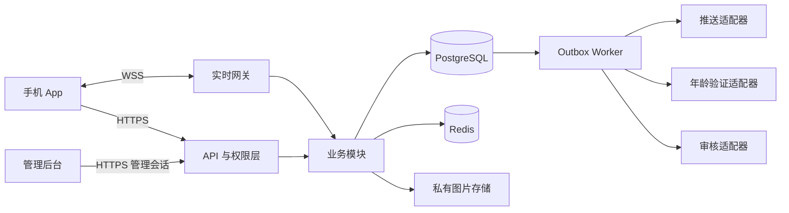

# 在日华人交友 App 技术方案

## 1. 范围与设计前提

依据：[产品设计方案](2026-10-03-social-app-design.md)。首发包含兴趣交友、恋爱配对、同城活动、公开留言板、群聊和管理后台。普通留言板允许未注册用户浏览、发帖、回复；恋爱功能要求注册、主动开启意愿及勾选“我已年满 18 岁”。勾选记录仅代表年龄自我声明，不代表证件核验。全站不设置统一的年龄确认弹窗。

本文是技术评审稿，不是已批准的逐步实施计划，也不代表代码或基础设施已建立。首发已确认同时开发 iOS 与 Android；邮箱验证码注册、游客图片发布已确认。暂按小团队、单一日本区域部署设计，团队规模、预算及部署方式仍待确认。

已确认：邮箱验证码注册；游客与注册用户均可在普通公开留言板的帖子及回复中发布图片，图片通过审核后展示；注册用户可以创建普通群，创建者成为群主，加入普通群无需审批。建议首版：活动免费；私聊仅在双方恋爱匹配后开放。普通用户关注及普通私聊可后续扩展。这些是建议默认值，不覆盖已确认的产品要求。

## 2. 技术选型与取舍

| 层次 | 建议技术 | 用途 |
|---|---|---|
| 手机端 | React Native、Expo、TypeScript | 共用业务界面，构建 iOS 与 Android App |
| 手机端数据 | TanStack Query、SQLite、SecureStore | 请求缓存、消息本地缓存、敏感令牌存储 |
| 管理后台 | React、Vite、TypeScript | 审核、群管理、活动管理与审计 |
| 后端 | NestJS、TypeScript | REST API、权限校验、业务模块 |
| 实时通信 | Socket.IO | 群聊和匹配私聊实时事件 |
| 主数据库 | PostgreSQL、Prisma | 持久化业务数据、事务和迁移 |
| 缓存 | Redis | 限流、临时验证码及实时事件分发 |
| 文件 | S3 私有存储、受控图片分发 | 隔离待审核与已发布图片 |
| 异步任务 | PostgreSQL outbox、独立 worker | 审核、通知、删除任务的可靠处理 |
| 推送 | expo-notifications、Expo Push 接口 | 对接系统推送，允许后续替换供应商 |

以上技术组合已获用户确认；具体版本及供应商配置仍需实施时确定。实施时选择相互兼容的稳定版本，锁定 lockfile、Node LTS 和 Expo SDK，不使用浮动 latest 作为生产约束。

备选 Flutter 适合已有 Dart 经验的团队；纯原生能更深入控制平台能力，但两端维护成本更高。本方案选择 TypeScript 共用技术体系。后端先采用模块化单体，API 和 worker 分开运行，暂不引入微服务、搜索集群或机器学习推荐。

Expo 推送需在 development build 和真实设备上验证，不能仅依赖 Expo Go。[官方开发构建说明](https://docs.expo.dev/develop/development-builds/faq/)

## 3. 系统结构与代码组织



建议仓库布局：

```text
apps/mobile/          手机端：按 board、groups、dating、events 划分功能
apps/admin/           管理后台
apps/api/src/modules/ accounts、board、chat、dating、events、moderation
apps/worker/          异步任务入口，复用业务服务
packages/contracts/  API 与实时事件 DTO、错误码、验证规则
packages/database/   数据模型、迁移、开发种子数据
infra/               部署与环境配置模板
```

模块不得直接调用其他模块的数据库写入逻辑；通过服务接口和事务协调。API 返回公开 DTO，不直接返回数据库实体。contracts 不包含秘密配置或后台专用字段。

## 4. 身份、权限与游客接续

### 游客身份

浏览公开内容无需令牌。首次发言前，客户端自动请求 `POST /v1/guest-sessions`，取得匿名 principal_id 和高熵随机凭证，不要求填写资料。服务端只存凭证摘要；手机端使用 SecureStore 保存敏感凭证。[SecureStore 官方说明](https://docs.expo.dev/versions/latest/sdk/securestore/)

凭证表示内容管理权限，不能用 IP 或设备指纹代替所有权证明。游客昵称按帖子与 principal_id 生成稳定显示标识，避免跨帖子公开追踪。令牌不得出现在 URL 或日志中。

### 注册与接续

建议邮箱验证码有效期 10 分钟、最多尝试 5 次、发送间隔 60 秒，均为可配置初始值。注册时同时验证邮箱和游客凭证，在事务中把匿名 principal 绑定到账号；既有帖子外键不变，保持原来的游客展示身份，除非用户主动选择公开关联。

账号使用短期访问令牌和可轮换、可撤销的刷新令牌；建议访问期 15 分钟、刷新期 30 天。刷新重放时撤销该会话。凭证丢失后不自动按设备或邮箱认领游客帖子，只提供人工内容投诉通道。

### 权限规则

后端每次操作校验身份、封禁状态、内容所有权、群成员关系和恋爱验证状态。客户端的按钮可见性不构成权限保障。管理员采用独立登录、多因素验证和角色权限，不使用手机端普通会话。

普通群不因未做恋爱年龄验证而拒绝使用；恋爱群、恋爱帖子及配对资料须进入独立受控领域。验证撤销后立即阻止恋爱查询和通信。

## 5. 数据模型与约束

所有主键使用 UUID；时间存 UTC，手机端按 Asia/Tokyo 展示。生日如需保存使用 DATE，不作时区转换。公开地区使用标准地区代码，不保存持续定位轨迹。

| 表 | 主要字段与约束 |
|---|---|
| principals、accounts、sessions | 游客或注册主体；账号邮箱唯一；会话可撤销 |
| profiles、interests、profile_interests、regions | 公开资料与标准地区；恋爱字段分离 |
| posts、comments | author_principal_id、scope、status、body、created_at；评论所属帖子约束 |
| groups、group_members | 群类型、状态及 creator_id；群主角色；唯一 group_id + account_id；加入和退出时间；普通群不设待审批成员状态 |
| conversations、messages、read_cursors | 群或配对会话；唯一 sender_id + client_message_id |
| dating_profiles、age_verifications | 主动开启标志；pending、verified、rejected、revoked；供应商引用 |
| likes、matches | 禁止自点赞；点赞方向唯一；匹配账号对规范排序并唯一 |
| events、event_registrations | capacity、confirmed_count、status；唯一 event_id + account_id |
| blocks、reports、moderation_actions | 屏蔽关系、举报对象、处理记录和管理员 |
| media_assets、outbox、processed_events | 资源可见状态；任务与供应商事件幂等记录 |

留言板以 scope 区分普通公开与恋爱内容，服务端强制过滤。恋爱 DTO 不出现在游客列表、搜索、缓存或公开图片 URL 中。

帖子索引 `(scope, status, created_at, id)`，消息索引 `(conversation_id, sequence)`；使用游标分页，默认 20 条、上限 50 条。数字 sequence 通过接口以字符串返回，避免 JavaScript 大整数精度丢失。搜索初期按地区、兴趣和中文关键词过滤，效果不足后再评估专用搜索。

## 6. API 与协议

REST 路径统一 `/v1`，使用 OpenAPI 描述。写操作支持 client_request_id 或 Idempotency-Key，并绑定主体、路由及请求摘要；同键不同内容返回冲突。错误格式为 `code、message、request_id`，不泄露内部异常。

| 接口示例 | 权限与行为 |
|---|---|
| GET /posts；POST /posts；POST /posts/:id/comments | 普通帖子公开读；游客会话或账号写；审核后可见 |
| DELETE /posts/:id | 校验作者凭证或管理员权限 |
| POST /auth/email-code；POST /auth/register | 验证码、限流、游客接续 |
| GET /groups；POST /groups；POST /groups/:id/join | 注册用户可创建普通群；校验群类型、封禁、状态和人数后直接加入，无审批流程 |
| GET /conversations/:id/messages | 校验当前成员或有效恋爱匹配 |
| POST /dating/verification-sessions | 已注册；创建验证流程 |
| POST /webhooks/age-verification | 供应商签名、重放保护，不接受客户端 verified 值 |
| GET /dating/candidates；POST /dating/likes | verified 且主动开启恋爱意愿 |
| POST /events/:id/registrations | 注册、活动状态和名额校验 |
| POST /reports；POST /blocks | 举报允许游客凭证；屏蔽建议要求注册 |
| DELETE /account | 撤销会话并生成数据删除任务 |

状态码区分 401 未认证、403 无权限、409 状态冲突或名额已满、422 内容不合法、429 超过频率。被屏蔽或无权访问的对象采用统一响应，避免探测用户关系。

## 7. 群聊与消息可靠性

NestJS 提供 WebSocket gateway，可配合 Socket.IO 实现实时入口。[官方说明](https://docs.nestjs.com/websockets/gateways)

连接建立时验证会话；加入 room 和每次发消息再次检查权限。令牌过期需重新认证。会话撤销、退群、封禁或恋爱资格失效时主动断开相关连接，并持续在服务端过滤事件。

发送事件包含 `conversation_id、client_message_id、body`。事务内分配会话序号、写入消息与 outbox，提交成功后 ACK；客户端先显示发送中，收到 ACK 后确认。重试同一 ID 返回原消息，广播允许重复到达，客户端按 message_id 去重。

断线重连后按 last_sequence 通过 REST 补取，不依赖 WebSocket 重放；在线状态只作提示。初版采用事务更新会话计数器获得有序序号，避免高流量大群；后续依据实测优化。

成员仅可读取当前加入区间内的消息；退群后不能查询，重新加入不自动获得退出期间历史。活动群报名取消后撤销成员资格。拉黑在群内隐藏对方消息和通知，并禁止新私聊；它不代表对方无法看到公开帖子，界面需说明。

推送默认不含消息正文或恋爱敏感信息，仅提示新消息；点击后重新鉴权。无效设备 token 停用，发送失败有重试与最终失败记录。

## 8. 恋爱配对与年龄验证

年龄验证提供统一适配器 `createSession、handleCallback、getStatus`，供应商选择与具体证件流程单独评审。默认优先第三方核验，后台保存结果、供应商引用、时间和必要审计证据，不默认保存证件照片。

状态机：未申请 → pending → verified 或 rejected；verified 可转 revoked。回调验证签名和事件唯一性，绑定用户及验证会话，拒绝跨账号替换和旧事件覆盖新结果。失效或复核由所选供应商策略决定。

匹配采用兴趣、地区和用户明确设置的偏好进行规则排序，不推断敏感属性。双向喜欢在数据库事务中创建唯一匹配及私聊会话；使用规范排序的账号对加锁，避免两个并发点赞遗漏匹配。拉黑、关闭恋爱意愿或验证撤销后停止配对与恋爱通信，历史数据依据保留政策处理。

日本相关业务适用性、申报与年龄确认方法须在上线前按实际功能确认。18 岁勾选不是本技术方案默认的核验方法；普通公开区禁止借帖子绕过恋爱权限发布征友联系方式。审核系统不能保证完全消除违规，需有人处理举报。[日本警察厅说明](https://www.npa.go.jp/policy_area/no_cp/deai/regulatory.html)

## 9. 活动并发与异步任务

报名事务锁定活动行，检查状态和时间，再检查注册记录与名额、更新 confirmed_count、写入报名和群成员记录。取消报名使用同一锁顺序撤销资格并释放名额。重复请求返回已有结果，不重复计数。活动群成员写入失败则整笔事务回滚。

活动取消在事务中禁止新报名，关闭活动群写入并产生通知任务；默认仅向原成员保留只读访问，保存多久须确定。场地详细信息与名单仅向有权用户展示。

PostgreSQL 行级锁适合上述并发控制，但仍需要固定加锁顺序及死锁重试。[官方锁文档](https://www.postgresql.org/docs/17/explicit-locking.html)

outbox 与业务数据同事务提交。worker 用租约或 SKIP LOCKED 领取任务，幂等处理、指数退避，建议最多 5 次后进入失败队列。不能依赖 Redis 通知作为唯一持久化记录。消息广播、图片审核、验证处理与推送各自记录任务结果，提供管理员重试入口。

## 10. 内容、文件与隐私

建议首版正文按纯文本显示，禁止 HTML；游客每分钟 3 次发言、每日 30 次为待试运营调整的初始限制，组合主体与网络风险信号，不能仅凭共享 IP 封禁所有人。异常时挑战验证，不对普通浏览强制验证。

内容状态 pending、visible、hidden、rejected、deleted。供应商审核异常时暂留 pending，不自动发布；人工审核可覆盖结果并保留审计。恋爱招募、公开个人联系方式、诈骗、骚扰、侵权等制定明确社区规则。

游客与注册用户上传图片均须持有有效主体凭证，再申请短时签名 URL，上传至隔离区，校验真实文件类型、大小、尺寸，去除 EXIF，再审核和生成展示版本。对象键随机生成，不能由客户端选择覆盖其他资源。S3 支持预签名上传，权限与对象键仍需服务端限制。[官方文档](https://docs.aws.amazon.com/AmazonS3/latest/userguide/using-presigned-url.html)

公开批准图片可缓存；恋爱与私有图片走权限校验和短期访问链接，不与公开 CDN 缓存混用。链接有短暂有效窗口，需明确权限撤销不等于已经下载的数据可被收回。

收集邮箱、地区和验证信息时说明用途。[个人信息保护委员会说明](https://www.ppc.go.jp/all_faq_index/faq1-q4-17/)

删除账号时立即撤销登录、推送与业务访问，随后删除公开资料、图片和按政策处理内容。个人信息、审计、备份的保留期限在上线前确定；备份恢复须重新应用删除记录，避免恢复已删除账号。日志不写正文、令牌、验证码或证件信息。

## 11. 部署、运维与成本

建议 AWS 东京区域：容器化 API、网关及 worker；托管 PostgreSQL、Redis、S3；TLS 负载均衡与 WAF；后台独立域名。实际服务规格通过压测和预算确定，不提前承诺月费。推送、邮件、验证和审核可能涉及日本以外处理，单一区域部署不等于所有数据均留在日本。

开发、测试、生产使用独立数据库、对象存储、验证凭据和推送配置。开发环境用 Docker Compose，年龄验证使用模拟适配器；生产禁止模拟验证结果。CI 执行 lint、类型检查、测试及构建；迁移先在测试环境演练，生产采用兼容旧版本的增量迁移，避免启动每个副本时自动改表。

首版可先单实例试运营，但不承诺高可用。正式可用性目标明确后配置多实例、多可用区数据库和 Redis adapter，并测试连接路由及故障恢复。Socket.IO 如启用 polling，需配置会话粘性；不能只增加实例数量。

建议恢复目标 RPO 1 小时、RTO 4 小时，属于预算待确认的目标。启用数据库备份与时间点恢复，定期实际恢复验证。监控 API 错误率、延迟、消息 ACK、outbox 积压、审核待办、验证失败、连接数和容量，配置值班告警与处理手册。

成本拆分：基础设施、存储流量、邮件、验证按次费、审核按量费、应用发布账号与人工运营；取得供应商报价后再给出预算。

## 12. 测试与验收

| 范围 | 测试方式与验收重点 |
|---|---|
| 权限 | 后端集成测试：游客与账号越权、群成员隔离、验证绕过、撤销后访问 |
| 游客 | 接续凭证、凭证丢失、重复注册、保持原展示身份、图片上传与删除、跨主体附件拒绝关联 |
| 并发 | 实际 PostgreSQL 测试：满员不超卖、重复取消、双向点赞同时发生 |
| 消息 | 持久化前失败不 ACK、重试去重、乱序广播、断线补取、退群断开 |
| 验证 | 签名伪造、重复回调、旧回调、跨账号替换、供应商超时 |
| 审核 | 待审不可见、文件伪装、EXIF、举报与管理员审计 |
| 手机端 | React Native Testing Library 与 Maestro：中文、两端真机、弱网、推送 |
| 后台 | Vitest 与 Playwright：角色权限、举报处理及失败任务重试 |
| 运维 | 备份恢复、删除记录重放、迁移失败、实例重启与任务恢复 |

API 建议 Jest、Supertest、Testcontainers；性能测试使用 k6。优先覆盖权限与事务，不以没有业务依据的覆盖率百分比代替验收。建议初始压测场景为 200 个实时连接、20 次/秒文本发送，目标服务端持久化 ACK p95 小于 1 秒；属于工程目标，需在确定规格后实测，不是既有性能承诺。

## 13. 实施阶段与评审事项

1. 基础与游客留言板：仓库、数据库、会话、游客发言、审核和管理后台，验证普通权限闭环。
2. 注册与群聊：身份接续、成员管理、消息持久化、断线补取及推送。
3. 恋爱：年龄验证适配器、受控资料、规则推荐、双向匹配及私聊。
4. 活动：发布、报名事务、活动群、取消与通知。
5. 上线验证：供应商接入、实际权限审查、两端真机、压测、恢复和运维演练。

阶段用于降低实施风险；目标首发包含全部核心功能，恋爱正式开放需先确认年龄核验要求。每阶段再制定独立、可验收的开发计划，每次完成一组修改并验证后创建本地 Git 提交。

进入编码前需确认：团队与预算、图片配额及外部联系方式规则、普通私聊策略、运营负责人、数据保留起算点与分类例外、首发地区与运行目标；正式恋爱上线的年龄核验要求另行确认。双平台、邮箱验证码注册、游客图片权限、注册用户创建普通群及无需审批加入已确认。文档中的建议值通过评审形成最终实施约束。
## 14. 用户确认的调整：年龄声明与一年保留期

本节更新第 1、4、5、6、8、10、11、12、13 节中对应的年龄与数据保留设计；第三方年龄核验暂为可扩展能力，不作为当前开发依赖。技术组合已确认。

### 年龄勾选

当前恋爱入口先采用未预选的“我已年满 18 岁”复选框。账号登录后，由 POST /v1/dating/age-declarations 提交 accepted=true 和声明文案版本；服务器写入 account_id、declared_at、statement_version。未勾选或撤销声明时，后端阻止恋爱功能。API 不接收由客户端指定的 verified 状态。

新增 age_declarations 表或等价结构，声明状态使用未声明、self_declared、withdrawn。只有后续实际核验才可写入 age_verifications 的 verified 状态。当前开发阶段规则为主动开启恋爱意愿且 self_declared；以后可配置为要求 verified，不将开发模式直接当作生产发布批准。

当前版本不接入验证供应商或证件上传；保留适配器接口为后续扩展设计。测试增加未勾选、撤销、绕过接口和重复声明场景；供应商签名等测试随正式适配器引入执行。架构图中的验证适配器是预留模块。

上线边界：日本官方规定的简化年龄询问方式，仅在不提供特定信息发布、浏览及通信服务等条件下适用；特定信息包括见面时间地点与联系方式。当前方案包含恋爱私聊，尚未证实满足这些条件。因此勾选方案可用于开发与原型，但正式开放恋爱通信前须确认适用性及必要的核验方式；不宣称勾选已满足上线要求。[日本警察厅施行规则说明](https://www.npa.go.jp/policy_area/no_cp/deai/rule.html)

### 数据保留一年

用户已确认保留期暂定一年。该决定作为业务内容与业务记录的默认保留期限，不表示把所有运行数据、当前账号资料或短期凭证统一保存一年。

建议实施口径：帖子、回复、消息及附件从创建时间起保留一个日历年；活动报名记录从活动结束或取消起保留一年；已结案举报与操作审计从结案或操作时间起保留一年。上述起算点仍需用户确认，确定前不得执行自动删除。活跃账号资料在服务期间使用，注销后立即撤销访问并按删除流程处理，不因账号创建满一年而自动删号。

年龄声明在启用恋爱功能期间需保持有效；撤销后记录保留一年为建议，须与核验和法定要求一起确认。验证码、访问令牌、刷新令牌继续采用原短期有效期；日志和备份另设较短的必要期限，不默认保存一年。用户主动删除可以早于一年；依法必要的保留不受默认一年策略替代。

业务记录增加 expires_at，以 UTC 存储并按约定起算点计算。worker 定期清理到期内容、关联附件、搜索与缓存；保留关系占位时清空正文及可识别信息，避免孤立外键。手机缓存同步删除状态，备份恢复重放删除记录。删除检查包括一年边界、跨闰年、级联清理、重复执行和恢复后不重新公开数据。

当前未确认事项缩减为：一年期限的起算点与分类例外、日志及备份期限，以及原方案中的平台、注册、运营、预算等选择。正式年龄核验仍为上线确认事项，不作为本次已完成的合规结论。

## 15. 双平台、邮箱注册与游客图片的实施约束

iOS 与 Android 使用同一 React Native / Expo 项目，分别构建、签名与真机验收。注册采用邮箱验证码；未注册发言不要求邮箱。新注册账号可在证明游客凭证所有权后接续原内容和图片。

新增 POST /v1/media/upload-intents 和 POST /v1/media/:id/complete，游客凭证或注册会话均可调用。media_assets 保存 owner_principal_id、object_key、status、size、expires_at 和审核结果。创建帖子或回复时校验每个 media_id 的所有权、上传完成状态及关联目标，拒绝绑定他人资源；客户端不能提交任意对象 URL 代替 media_id。

上传完成后由服务端核对对象大小和真实文件类型，解码、限制尺寸、去除 EXIF、生成展示版本及审核。待审与被拒图片不公开。帖子带有待审图片时保持待审，全部资源审核通过后发布；失败时允许作者移除或替换资源并重新提交。游客凭证可以删除本人内容和附件，注册后继承所有权。

建议初始限制：每帖或回复最多 3 张、单张不超过 5 MB、只接受 JPEG/PNG/WebP 静态图片，解码像素上限 2000 万；签名上传有效期 5 分钟，未关联附件 24 小时后清理。上传配额与发言次数分别计数，游客按主体和网络风险组合限流。以上数值属于待评审配置，不是已确认的产品限制。

两端都使用系统图片选择器并处理取消、权限拒绝、应用重启、弱网重试和审核状态。重试使用相同上传请求标识，不创建重复资源；超过签名期限重新申请。删除和一年保留清理需同步移除展示版本与对象缓存，未关联附件使用短期清理规则，不等待一年。

验收覆盖游客无需注册上传、他人附件越权、格式伪装、超限、待审不可见、删除后访问、注册接续、两端真机选图和重试。审核与存储异常时保留编辑内容并显示状态，不将失败资源自动公开。

## 16. 注册用户创建群与直接加入

POST /v1/groups 要求有效注册会话和正常账号状态。创建普通群时在同一事务写入群记录及创建者的 owner 成员记录；成功后创建者可进入群聊。接口不接受客户端指定其他用户为群主，也不设置入群申请表或审批队列。群名称、介绍、地区和主题使用既有内容规则；无需入群审批不等于免除违规内容处理。

POST /v1/groups/:id/join 锁定群记录，检查群有效状态、账号限制、群内封禁、类型资格及容量，再直接写入 active 成员。重复加入幂等返回已有成员，竞争最后一个名额不超员；失败不创建成员或开放消息。普通群无需管理员审批。活动群仍通过有效报名获取资格；恋爱群仍执行恋爱权限检查，不能通过普通入群接口绕过。

创建者作为群主可管理群信息、公告与成员；普通成员不具有这些权限，平台运营管理权限独立。群主退出前需转让或解散的具体策略、创建频率和人数限制属于进一步细化项。被群封禁用户不能反复加入；平台可处理违规群。游客不能通过接口创建或加入群，只可浏览普通群公开概要。

测试覆盖注册创建成功且拥有群主角色、游客拒绝、重复请求幂等、无需审批即加入、满员竞争、封禁拒绝、群关闭拒绝、群主管理越权及活动/恋爱群资格隔离。当前仓库只有设计图册，上述为后续业务实现验收要求，不宣称已执行后端测试。
